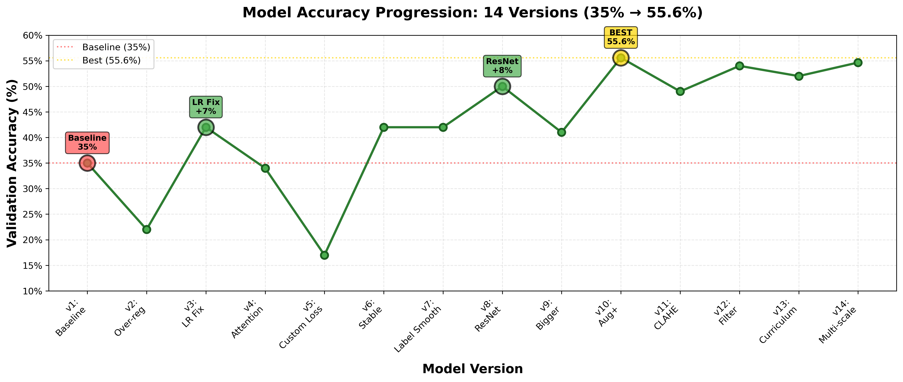

   
   
   
   

# CAPTCHA Recognition using CRNN + CTC

  

  <a href="https://huggingface.co/spaces/TechRaj/cs4243-miniproject-captcha-recognition">🚀 Live Demo</a> •
  <a href="model_logs.md">📊 Training Logs</a> •
  <a href="diagrams/ARCHITECTURE_DIAGRAM.md">🏗️ Architecture</a>

## Project Overview

A  CAPTCHA recognition system achieving **55.6% sequence accuracy** and **85.8% character accuracy** using a custom ResNet-CRNN architecture with CTC loss. This project demonstrates the complete ML lifecycle: from data preprocessing → experimentation → deployment.

### Dataset

**Download**: [CAPTCHA Training Images on Kaggle](https://www.kaggle.com/datasets/techraj/captcha-training-images)

### Key Highlights

- **Architecture**: ResNet-style CNN (6 residual blocks) + Bidirectional LSTM
- **Journey**: Improved from 35% → 55.6% accuracy through systematic experimentation
- **Data Augmentation**: Rotation, shear, noise, brightness, synthetic black lines
- **Deployed**: Live Gradio demo on Hugging Face Spaces with confidence scoring
- **Documentation**: Comprehensive logs tracking all 14 experimental versions