# CAPTCHA Recognition Pipeline Architecture

**Model**: CTC-CRNN (v10 - Final)  
**Performance**: 55.6% sequence accuracy, 85.8% character accuracy  

---

## Complete Pipeline Overview

---

## Detailed Model Architecture (v10)

```mermaid
graph TB
    subgraph Input["Input Layer"]
        I1[Image: 1 x 80 x 280<br/>Grayscale, normalized]
    end
    
    subgraph CNN["ResNet-style CNN Feature Extractor"]
        direction TB
        C1["Conv2d(1→64, 3x3)<br/>+ BatchNorm + ReLU"]
        P1["MaxPool(2x2)<br/>→ 64 x 40 x 140"]
        D1["Dropout2d(0.15)"]
        
        R1["ResBlock 1a (64→128)<br/>Conv-BN-ReLU-Conv-BN + skip"]
        R2["ResBlock 1b (128→128)<br/>Conv-BN-ReLU-Conv-BN + skip"]
        P2["MaxPool(2x2)<br/>→ 128 x 20 x 70"]
        D2["Dropout2d(0.15)"]
        
        R3["ResBlock 2a (128→256)<br/>Conv-BN-ReLU-Conv-BN + skip"]
        R4["ResBlock 2b (256→256)<br/>Conv-BN-ReLU-Conv-BN + skip"]
        P3["MaxPool(2x1)<br/>→ 256 x 10 x 70"]
        D3["Dropout2d(0.15)"]
        
        R5["ResBlock 3a (256→512)<br/>Conv-BN-ReLU-Conv-BN + skip"]
        R6["ResBlock 3b (512→512)<br/>Conv-BN-ReLU-Conv-BN + skip"]
        P4["MaxPool(2x1)<br/>→ 512 x 5 x 70"]
        D4["Dropout2d(0.2)"]
    end
    
    subgraph Sequence["Sequence Mapping"]
        S1["Reshape<br/>512 x 5 x 70<br/>→<br/>70 x (512*5)"]
        S2["70 time steps<br/>2560 features each"]
    end
    
    subgraph RNN["Bidirectional LSTM"]
        L1["LSTM Layer 1<br/>input: 2560<br/>hidden: 384<br/>bidirectional"]
        L2["LSTM Layer 2<br/>input: 768<br/>hidden: 384<br/>bidirectional<br/>dropout: 0.3"]
        L3["Output: 70 x 768"]
    end
    
    subgraph Classifier["Classification Head"]
        FC["Fully Connected<br/>768 → 63"]
        LS["Log Softmax"]
        OUT["Output: 70 x 63<br/>70 timesteps<br/>63 classes (a-z, 0-9 + blank)"]
    end
    
    I1 --> C1 --> P1 --> D1
    D1 --> R1 --> R2 --> P2 --> D2
    D2 --> R3 --> R4 --> P3 --> D3
    D3 --> R5 --> R6 --> P4 --> D4
    D4 --> S1 --> S2
    S2 --> L1 --> L2 --> L3
    L3 --> FC --> LS --> OUT
    
    style I1 fill:#e1f5ff
    style OUT fill:#d4edda
    style C1 fill:#fff3cd
    style R1 fill:#ffe4b5
    style R2 fill:#ffe4b5
    style R3 fill:#ffe4b5
    style R4 fill:#ffe4b5
    style R5 fill:#ffe4b5
    style R6 fill:#ffe4b5
    style L1 fill:#ffd4d4
    style L2 fill:#ffd4d4
```

---

## Training Loop Flow

---

## Data Flow Dimensions

---

## ResNet Block Detail

---

## CTC Loss & Decoding

---

## Augmentation Pipeline

---

## Hyperparameters Summary

```mermaid
mindmap
  root((v10 Config))
    Architecture
      CNN: ResNet-style
      LSTM: 384 hidden, 2 layers
      Dropout: 0.15-0.2 CNN, 0.3 LSTM
      Params: ~8M trainable
    Training
      Optimizer: AdamW
      LR: 0.001
      Weight Decay: 1e-4
      Batch Size: 64
      Epochs: 150 max
    Loss
      CTC Loss
      Label Smoothing: 0.1
      Gradient Clip: 5.0
    Schedule
      Warmup: 5 epochs
      ReduceLROnPlateau
      Factor: 0.5
      Patience: 8
    Regularization
      Dropout2d: 0.15-0.2
      LSTM Dropout: 0.3
      Weight Decay: 1e-4
      Early Stop: patience 10
    Augmentation
      Rotation: ±5°
      Shear: ±10°
      Translation: ±3,±2
      Lines: 1-2 random
      Brightness: 0.85-1.15
      Noise: Gaussian std=2
```

---

## Model Evolution Timeline

---

**Key Milestones:**
- **v1 (35%)**: Baseline with severe overfitting
- **v3 (42%)**: Fixed LR schedule breakthrough (+7%)
- **v8 (50%)**: ResNet architecture breakthrough (+8%)
- **v10 (55.6%)**: Enhanced augmentation - BEST MODEL (+5.6%)
- **v13-v14**: Failed experiments confirmed v10 is optimal

**What the chart shows:**
- 6 successful improvements (upward spikes at v3, v8, v10)
- 8 failed experiments (downward: v2, v4, v5, v9, v11, v13; flat: v6, v7, v12, v14)
- Systematic iteration: 35% → 55.6% (+20.6% total gain)
- v10 remains the production model despite 4 more attempts

---

## Key Architecture Decisions

| Component | v1 (Baseline) | v10 (Best) | Why Changed |
|-----------|---------------|------------|-------------|
| **CNN** | VGG-style | ResNet blocks | Skip connections for gradient flow |
| **LSTM Hidden** | 256 | 384 | Better capacity without overfitting |
| **Dropout** | None | 0.15-0.3 | Combat overfitting |
| **Augmentation** | Basic | Enhanced (shear, lines) | Match CAPTCHA distortions |
| **LR Schedule** | Fixed | Warmup + Plateau | Stable CTC alignment |
| **Loss** | CTC | CTC + Label Smoothing | Prevent overconfidence |
| **Optimizer** | Adam | AdamW + Weight Decay | Better regularization |

---

## How to Use This Model

---

## Error Analysis: Length & Position

**Length Correctness** (shows CTC alignment quality):

**Error Position Distribution** (no positional bias):

---

## Top Confusion Pairs (Directional counts)

Exact counts from v10 error analysis (directional):

| From | To | Count |
|------|----|-------|
| o | 0 | 15 |
| 0 | o | 14 |
| i | 1 | 14 |
| 5 | s | 9 |
| l | 1 | 7 |
| l | i | 7 |
| 1 | i | 5 |
| s | 5 | 5 |
| 1 | l | 5 |
| 8 | b | 4 |

| Pair | Total |
|------|-------|
| 0 ↔ o | 29 |
| i ↔ 1 | 19 |
| l ↔ 1 | 12 |
| 5 ↔ s | 14 |
| 8 ↔ b | 4 |

---

## Top Confusion Pairs (Bar Chart, Poster)

## Results & Metrics 

| Metric | Value |
|--------|-------|
| Sequence Accuracy (best) | 55.6% (epoch ~55–60) |
| Character Accuracy | 85.82% |
| Train Loss | 1.21 |
| Validation Loss | 1.39 |

---